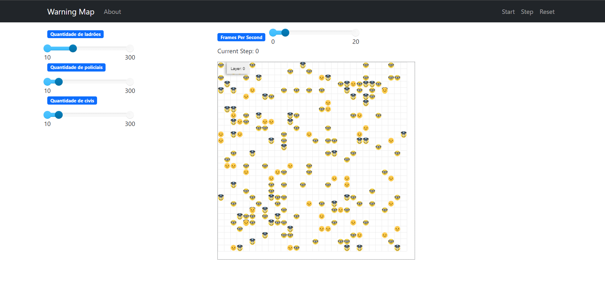

# Warning Map

**Disciplina**: FGA0210 - PARADIGMAS DE PROGRAMAÇÃO - T01  
**Nro do Grupo**: 05 
**Paradigma**: SMA 

## Alunos

|Matrícula | Aluno |
| -- | -- |
| 180041592  |  [Denys Rogeres Leles dos Santos](https://github.com/DenysRogeres) |
| 180113259  |  [Felipe Correia Andrade](https://github.com/Percon12) |
| 180103580  |  [Jonathan Jorge Barbosa Oliveira](https://github.com/Jonathan-Oliveira) |
| 180125885  |  [Lucas Melo dos Santos](https://github.com/luucas-melo) |
| 180127535  |  [Mateus Brandao Teixeira](https://github.com/mateusbrandaot) |
| 180106821  |  [Mateus Gomes do Nascimento](https://github.com/matgomes21) |
| 180127641  |  [Matheus Afonso de Souza](https://github.com/Matheusafonsouza) |
| 180138545  |  [Thiago Mesquita Peres Nunes de Carvalho](https://github.com/thiagompc) |
| 180132245  |  [Vinicius de Sousa Saturnino](https://github.com/viniciussaturnino) |

## Sobre

Esse é um software SMA que se baseia em relacionamento entre os agentes: pessoa, ladrão e polícia. O ladrão pode assaltar a pessoa fazendo que que ela se torne uma vítima e consequentemente irá mudar seu emoji. Mas para salvar a pessoa há o policial que se encontrar um ladrão ele o prende, fazendo com que o ladrão saia da grid, salvando as pessoas.

## Screenshots

## Instalação

**Linguagens**: python 
**Tecnologias**: MESA 
Para conseguir usar o projeto, é necessario ter o python(Recomendado python 3.10) e o framework MESA instalado na máquina.

## Uso

Para roda o projeto, após ter os requisitos necessarios intalados. Basta clonar projeto para o repositório local, entrar na pasta "src" usando:
<pre><code> cd src
</code></pre>
e rodar:
<pre><code> python run.py
</code></pre>

## Vídeo

Adicione 1 ou mais vídeos com a execução do projeto.
Procure:
(i) Introduzir o projeto;
(ii) Mostrar passo a passo o código, explicando-o, e deixando claro o que é de terceiros, e o que é contribuição real da equipe;
(iii) Apresentar particularidades do Paradigma, da Linguagem, e das Tecnologias, e
(iV) Apresentar lições aprendidas, contribuições, pendências, e ideias para trabalhos futuros.
OBS: TODOS DEVEM PARTICIPAR, CONFERINDO PONTOS DE VISTA.
TEMPO: +/- 15min

## Participações

Apresente, brevemente, como cada membro do grupo contribuiu para o projeto.
|Nome do Membro | Contribuição | Significância da Contribuição para o Projeto (Excelente/Boa/Regular/Ruim/Nula) |
| -- | -- | -- |
| Denys Rogeres Leles dos Santos  |   |  |
| Felipe Correia Andrade  |   |   |
| Jonathan Jorge Barbosa Oliveira  |   |  |
| Lucas Melo dos Santos  |   |  |
| Mateus Brandao Teixeira  |   |  |
| Mateus Gomes do Nascimento  |   |  |
| Matheus Afonso de Souza  |   |  |
| Thiago Mesquita Peres Nunes de Carvalho  |   |  |
| Vinicius de Sousa Saturnino  |   |  |

## Lições Aprendidas

Nesse projeto aprendemos sobre SMA em geral, que era um paradigma até então desconhecido pela maioria do grupo. Nele vimos como os agente se relacionam e são utulizados. Aprendemos também sobre o framework MESA que é um framework de python para SMA. Uma experiencia maior em python.

## Percepções

Depois da execução deste trabalho, os membros do grupo estão mais preparados para aprender novos paradigmas, visto que foi um grande desafio ter que "reprogramar o cérebro" para pensar em um novo paradigma, mas agora o grupo já possui uma experiência neste processo. E além disso, o grupo percebeu que contar apenas com o paradigma mais utilizado no momento pode ser uma estratégia perigosa, porque o mercado e as tecnologias podem mudar a qualquer momento com um novo paradigma, e por conta disso, saber aprender um novo paradigma é muito importante.

## Contribuições e Fragilidades

Com o desenvolvimento do projeto, foi evidente que no início o grupo teve uma grande dificuldade de contribuir com o projeto, visto que é uma linguagem e um paradigma novos para os membros. Mas ao decorrer do projeto, o entendimento do grupo aumentou sobre a linguagem e sobre o paradigma, e as contribuições ficaram mais fáceis de se fazer e o projeto pôde ser concluído.

## Trabalhos Futuros

Como trabalho fututo, temos algumas ideias que podem ser interessantes, sendo elas:

- Adicionar mais tipos de agentes
- Colocar uma reação diferente na relação de um agente com o outro
- Aumentar o numero de agentes

## Fontes

- Como referência motivacional utilizamos (<https://g1.globo.com/mundo/noticia/2013/11/brasil-tem-terceira-maior-taxa-de-roubos-da-america-latina-diz-pnud.html>)
- Para a elaboração do projeto e ajuda no desenvolvimento, utilizamos o [Repositório 1](https://github.com/UnBParadigmas2021-1/2021.1_G1_SMA_Universitarios)
- Para ideia de elaboração utilizamos o [Repositório 2](https://github.com/projectmesa/mesa/tree/main/examples/wolf_sheep)
